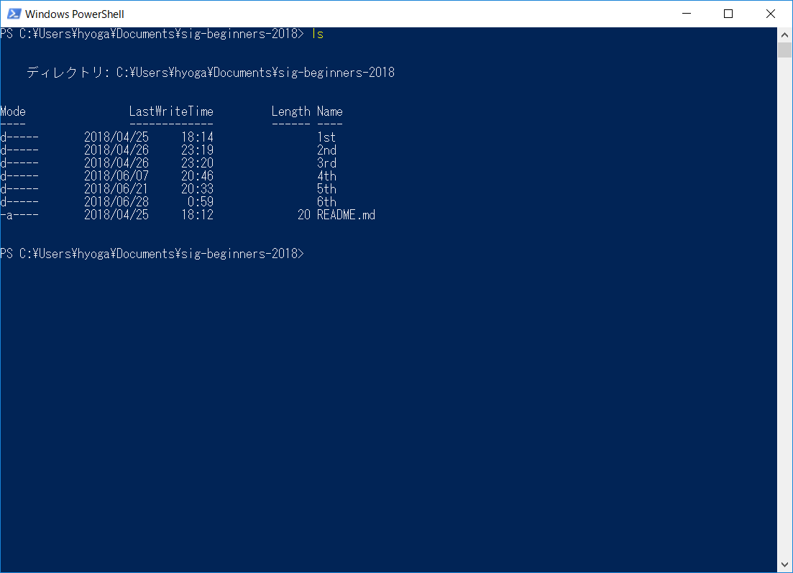
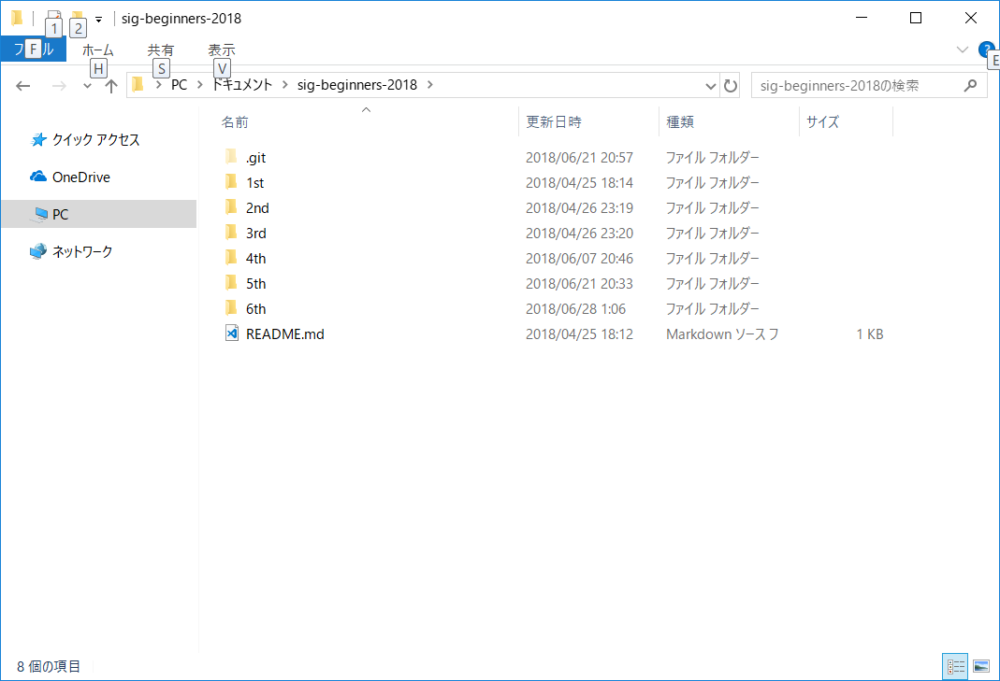
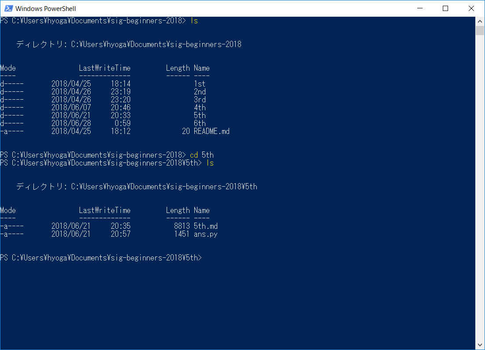
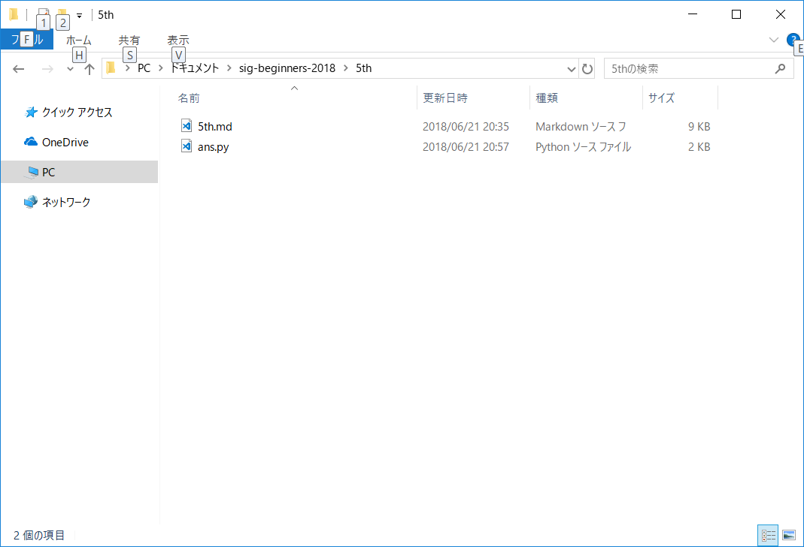
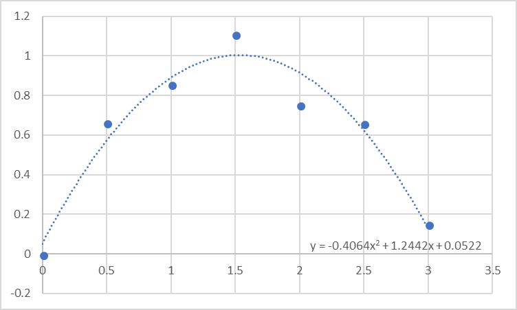
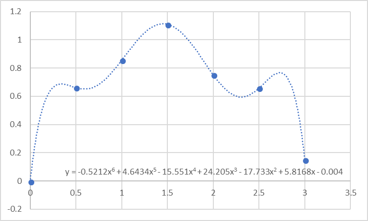

# TSG2018年Sセメスター初心者分科会\#6
今回か次回で終わりにしようと思っていますが、今回は「ターミナルの使い方」と「機械学習の入門の入門」でお送りいたします。

### ターミナルの使い方
ターミナル（Windowsではコマンドプロンプト。以下ターミナルで表記を統一します）は今までの初心者分科会でも少しだけ使いました。「cd」「ls(dir)」の扱いには慣れたでしょうか？

ターミナルは「bash(linuxの場合)」という言語を用いています。これもプログラミング言語です。が、この勉強とかをしていると時間が過ぎていくので、ターミナルの最低限の使い方だけ触れていきます。Windowsユーザーはコマンドプロンプトではなく、PowerShellを使えると大体のコマンドはあると思います。まずは復習から。

#### ls
その場所（ディレクトリ）の中身一覧を見ます。画像見ると分かりやすいかも。



出力結果は使っているものによって違うかもしれません。オプションというものが付けられて、例えば

* 「ls -a」は「隠しファイルも含め全部表示」
* 「ls -l」は「詳細表示（画像がそんな感じ）」

という感じで、後ろに「-(alphabet)」で色んなオプションを付けられます。因みに、「-h」はヘルプ表示。他のオプションについても載っています（これはほとんどのコマンドに存在します）。<br>

完全に余談だけど、「sl」というコマンドがlinuxには存在します（デフォルトでは無いですが）。何のコマンドかはお楽しみ。

#### cd
場所（ディレクトリ）を変更します。



今回何もなしに「5th」で5thフォルダの中に入りました。これもいろいろあって、

* 「./」…今いるディレクトリを示す。
* 「../」…一つ上（親）のディレクトリへ行く。
* 「/」…一番上のディレクトリへ行く（WindowsではCドライブ直下、MacやLinuxではroot）
* 「-」…1回前のcdの移動前のディレクトリへ戻る。

つまり、「cd 5th」は「cd ./5th」の略といってもいいでしょう。

#### mkdir
make directory.ディレクトリ=フォルダを作ります。「mkdir (フォルダ名）」。

#### rm
超危険なコマンドで知られる「rm」。ファイルを削除します。「rm (ファイル名)」。ディレクトリを削除するときは「-rf」とかつけたりします。警告が何も無いので要注意。特に「sudo rm -rf /」とか（root以降全部消します）。

#### mv
ファイルを移動します。「mv (移動するファイル名) (移動先)」。移動先にファイル名まで入れると、リネームも出来ます。

#### cp
ファイルをコピーします。他はmvと同じ。

#### man
マニュアルです。例えば、「man ls」とやると「ls -h」と同じ内容が出てきます。とても大事です。

#### clear
やっても基本的に損はないし、分かりやすいので打って試してみてください。

#### exit
ターミナルを終了します（厳密にはログアウトです）

#### リダイレクト
コマンドではありませんが、知っておくと絶対得するので。

pythonでプログラムを書きます。例えば、
```python
# hoge.py
print("Hello,World")
```
というプログラムを書きました。でも、出力は`hoge.txt`に書き込みたいです。（別の方法は後でやります）

そんな時、`python hoge.py > hoge.txt`とすると本来ターミナル上に出るはずの出力が代わりに`hoge.txt`に出力されます（そのファイルが存在しなければ作成されます）。上書きなら`>>`。逆向き（＝`<`）にするとキーボード入力の代わりにファイルから読み込むことが出来ます。

これで一通りかなと思います。他にもものすごくいっぱいあるのですが、取り敢えずこの程度で。

### 機械学習の入門の入門
とても簡単な話しかしないつもりです。自分自身詳しくないので、下手に話すと鉞が飛んでくる…

#### 機械学習の種類
大まかに「教師あり学習」と「教師なし学習」の2通りに分かれます。例えば猫の画像がたくさんあって、それぞれの猫が何の種類か記述してあるデータがあったとして、これを用いて「猫の種類を判別する」学習器を作るなら「教師あり学習」となります。一方、ブロック崩しのAIを作るときはスコアを元に教師なし学習を行います。

自分は教師なし学習全くダメなので、今回は教師あり学習に絞ります。教師あり学習は「回帰」「分類」に分かれます。数値予測とグループ予測です。

#### 回帰問題について
ちょっと数学的な話をします。例えば、那覇、大阪、札幌の気温から東京の気温を予測してみるとしましょう。仮に線形だとすれば、


という感じで書けそうです。これを行列を用いて表現すると、


となります(bに注意)。

この


という形式の`w`を頑張って見つけるのが学習です。今回、その「`w`を見つける」アルゴリズムについては省略して、「ブラックボックス」として置いておきます。一応yの誤差の2乗が最小になるようにしているのですが…ここで面白いのは、「線形」とさっき書きましたが、この形式では例えば`x`に`x^2`も混ぜることが出来ます。やろうと思えば複雑な関数すらOKです。

ついでなのでよく聞く「過学習」についても少しだけ。ところで、`w`の要素数が`N`の時に、`N`個未満のデータしか用意できなかったとき、どうなるでしょう？例えばExcelの近似曲線（多項式）をイメージすると分かりやすいのですが、点に合わせに行くことに拘って無茶苦茶な曲線が生まれがちです。




これはExcelでy=sin(x)に上下幅0.2ずつの誤差を加えたものです。前者は2次曲線、後者は6次曲線でフィッティングさせました。明らかに前者の方が予測能力は高いでしょう。

これを防ぐために、機械学習では


の項を評価値に加えます。すると、過学習しているときには「係数が大きくなる」という特徴があるため、大体の場合で防げるみたいです。ただ、この`λ`がどの程度がいいのか、これを探す必要があります。<br>

さて、理論のお話はつまらないので、この辺で切り上げて実際に使ってみましょう。

<!--この辺で実践をやりたい-->

##### 実践
今回はボストンの住宅価格を犯罪率や黒人の比率等々から予測します。scikit-learnというモジュールを用いて学習します。このモジュールは学習器からデータまで取り扱っているもので、とても便利です。

取り敢えず、今回大量のモジュールを使うのですが、元々Pythonに入っていないもの（＝プロが作ってネットにアップしているもの）がほとんどです。何か必要になったら、ターミナル上で`pip install (必要なもの)`とするとインストールが出来ます。

今回必要なものは`pandas`(表を見やすく表示できます)、`matplotlib`(グラフ描画)、`numpy`(行列演算)、`scipy`(numpyを用いた統計・科学演算)そして`sklearn`(機械学習、データセット)の5つです。

```python
# インポートしていきます
import pandas as pd
import matplotlib.pyplot as plt
import numpy as np

#データセットの取得
from sklearn.datasets import load_boston
# 読み込みます
boston = load_boston()
# bostonはdict型といって（確かやってない）配列のindexにオブジェクトを取ります。使われているindexはboston.keys()で一覧表示されます
print(boston)

# つらいのでpandas投入
boston_df = pd.DataFrame(boston.data)
# ラベルを追加します
boston_df.columns = boston.feature_names
# まだ入っていないので知りたい「価格」を追加
boston_df["PRICE"] = boston.target
print(boston_df)

# 学習しまーす
# 取り敢えずimport
from sklearn.linear_model import Ridge
from sklearn.model_selection import train_test_split

model = Ridge(alpha = 0.1) # λ=alphaとして考えていい

# データについて
X = boston.data
Y = boston.target
X_train, X_test, Y_train, Y_test = train_test_split(X, Y)

# trainデータで学習
model.fit(X_train, Y_train)

# 結果
score = model.score(X_test, Y_test)
print(score)

# 詳細を見る
coef = pd.DataFrame()
coef["name"] = boston.feature_names
coef["coef"] = model.coef_
print(coef)

#@title cross validation
from sklearn.model_selection import KFold
fromsklearn.metrics import accuracy_score

# alphaは指数的に等間隔に20分割
alpha_list = np.geomspace(10**-3, 10**2, 20)
print("alpha =", alpha_list)

# 記録用。あとでグラフプロットに使います
scores_train = []
scores_test = []

for alpha in alpha_list:
    # データセットをK回テストします（その中で分割方法を変える）
    kf = KFold(n_splits=10,random_state=20180628)
    scores_training = []
    scores_testing = []
    for train_index, test_index in kf.split(X):
        # データの分割
        X_train_cv, X_test_cv = X[train_index], X[test_index]
        Y_train_cv, Y_test_cv = Y[train_index], Y[test_index]
        
        # 学習器
        model_cv = Ridge(alpha = alpha)
        model_cv.fit(X_train, Y_train)
        
        # 予測
        pred_train = model.predict(X_train)
        score_training = accuracy_score(Y_train, pred_train)
        scores_training.append(score_training)
        pred_test = model.predict(X_test)
        score_test = accuracy_score(Y_test, pred_test)
        scores_test.append(score_test)

# matplotlib。x,y,labelの順
plt.semilogx(alpha_list, scores_train, label="training")
plt.semilogx(alpha_list, scores_test), label="test")
plt.xlabel("alpha")
plt.ylabel("score")
plt.legend()
plt.show()
```

#### 分類問題について
Deep Learningではこちらを取り上げることがとても多いです。手書き文字を認識したり（どの文字か分類します）、写真に写っているものが何か判別したり。Deep Learningやってもいいのですが、その前に普通の分類を少しだけやりましょう。

よくある分類手法として用いられやすいのは「それがグループAに属するか属さないかの判別」です。「60歳以上であるか否か」「男性か否か」「猫か否か」みたいな感じで、ほぼ同じ学習器をたくさん作ると幸せになれます。

分類も回帰と同じような感じです。y>0かy<0かで境界線を引きます。でも、これじゃあ内容同じでつまらないので、こちらは深層学習の方面からアプローチしたいと思います。

深層学習はニューラルネットワークの一種です。ニューラルネットワークは神経のお話で出てくるニューロンの活性を模した数学モデルで、その神経に与えられる刺激(これらはニューロンから出ている)を`x`という行列にまとめた時、`y=wx+b>0`で発火します。具体的にはそのニューロンの刺激は`max(0,y)`となっています(reluで検索してみよう)。つまり、イメージとしては上の`y=wx`の行列を各ニューロンが持っていて、そのニューロン達がたくさん連なっているものと。

という訳で理論編終了。実践に入ります。

<!--実践-->

### 最後に
これで今回は終わりです。今回は機械学習をざっくりやりましたが、興味のある方はkaggleというサイトを見てみてもいいと思います。

他にもCTFとか競プロとかゲームとか色々触れられたらいいのですが、時間が短すぎましたね…それぞれ色々触ってみて、面白い！と思った分野を極めて貰えればと思います。