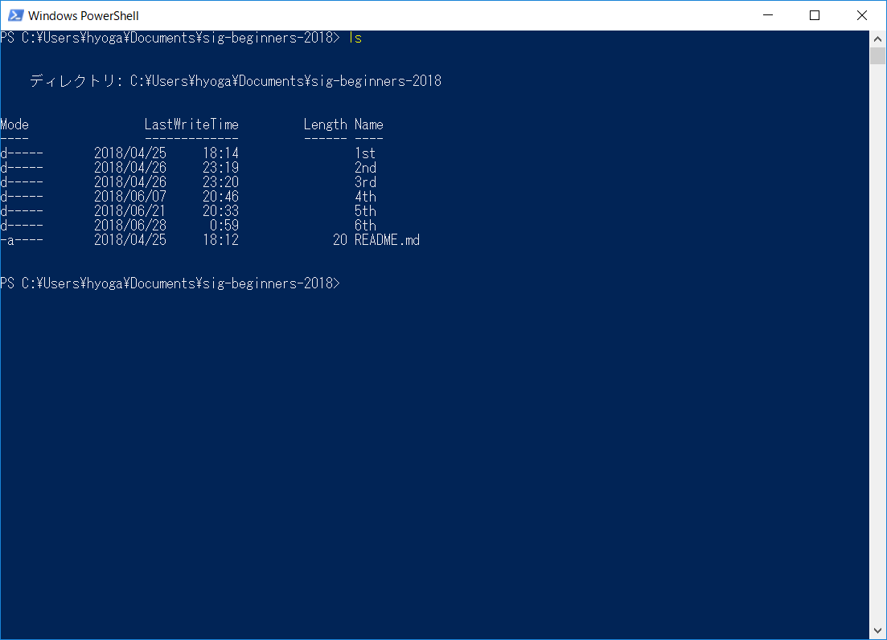
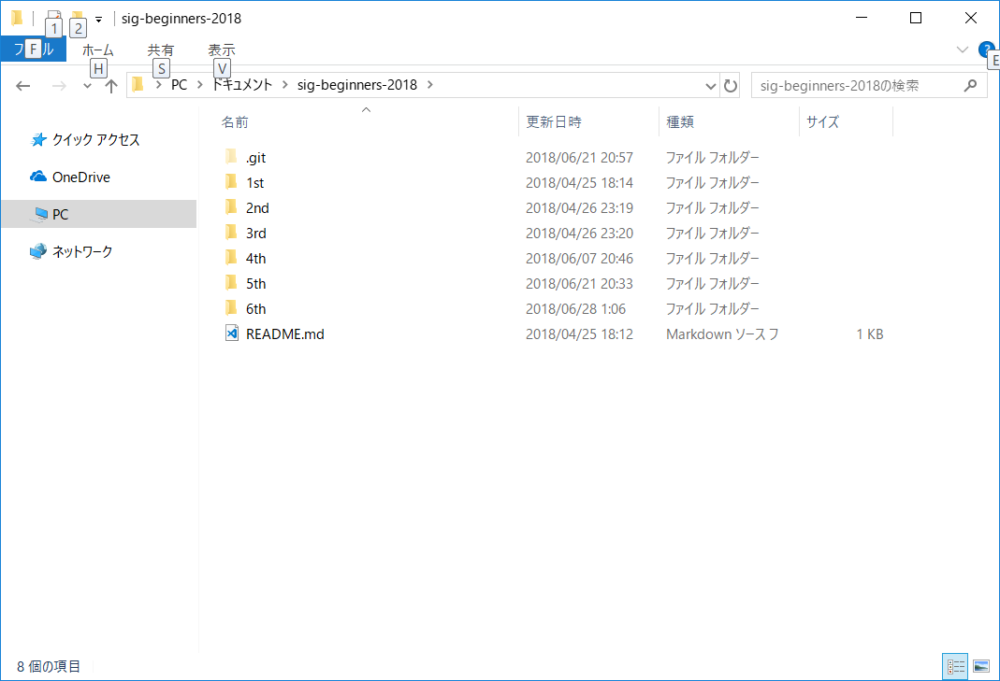
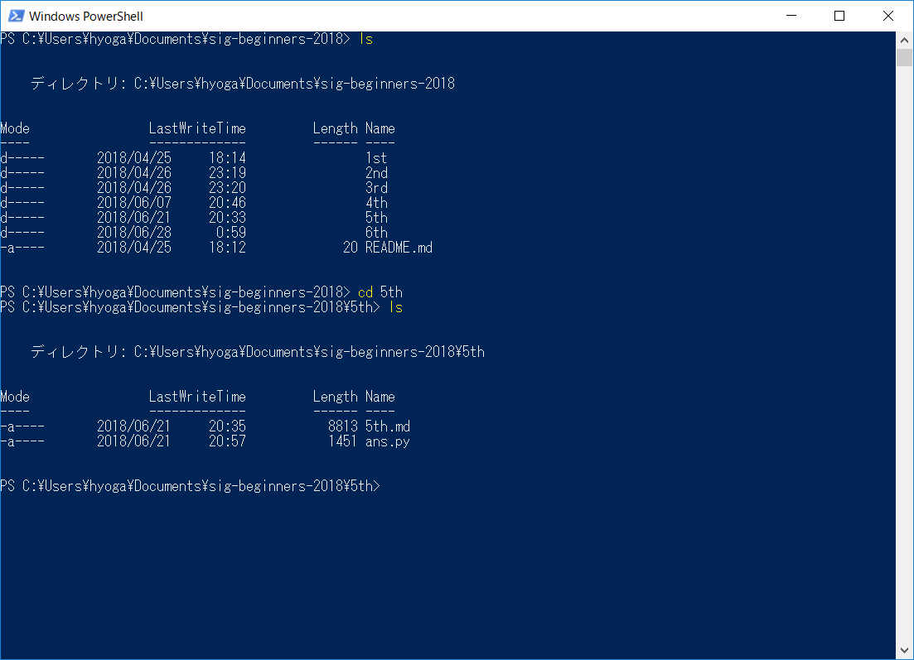
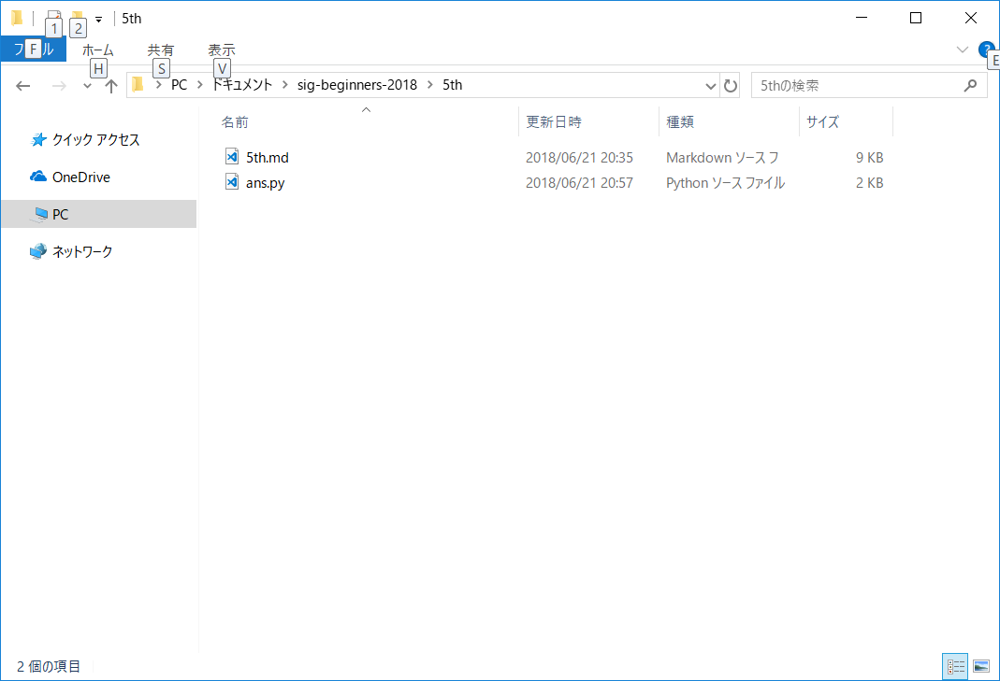

# TSG2018年Sセメスター初心者分科会\#6
今回か次回で終わりにしようと思っていますが、今回は「ターミナルの使い方」と「機械学習の入門の入門」でお送りいたします。

### ターミナルの使い方
ターミナル（Windowsではコマンドプロンプト。以下ターミナルで表記を統一します）は今までの初心者分科会でも少しだけ使いました。「cd」「ls(dir)」の扱いには慣れたでしょうか？

ターミナルは「bash(linuxの場合)」という言語を用いています。これもプログラミング言語です。が、この勉強とかをしていると時間が過ぎていくので、ターミナルの最低限の使い方だけ触れていきます。Windowsユーザーはコマンドプロンプトではなく、PowerShellを使えると大体のコマンドはあると思います。まずは復習から。

#### ls
その場所（ディレクトリ）の中身一覧を見ます。画像見ると分かりやすいかも。



出力結果は使っているものによって違うかもしれません。オプションというものが付けられて、例えば

* 「ls -a」は「隠しファイルも含め全部表示」
* 「ls -l」は「詳細表示（画像がそんな感じ）」

という感じで、後ろに「-(alphabet)」で色んなオプションを付けられます。因みに、「-h」はヘルプ表示。他のオプションについても載っています（これはほとんどのコマンドに存在します）。<br>

完全に余談だけど、「sl」というコマンドがlinuxには存在します（デフォルトでは無いですが）。何のコマンドかはお楽しみ。

#### cd
場所（ディレクトリ）を変更します。



今回何もなしに「5th」で5thフォルダの中に入りました。これもいろいろあって、

* 「./」…今いるディレクトリを示す。
* 「../」…一つ上（親）のディレクトリへ行く。
* 「/」…一番上のディレクトリへ行く（WindowsではCドライブ直下、MacやLinuxではroot）
* 「-」…1回前のcdの移動前のディレクトリへ戻る。

つまり、「cd 5th」は「cd ./5th」の略といってもいいでしょう。

#### mkdir
make directory.ディレクトリ=フォルダを作ります。「mkdir (フォルダ名）」。

#### rm
超危険なコマンドで知られる「rm」。ファイルを削除します。「rm (ファイル名)」。ディレクトリを削除するときは「-rf」とかつけたりします。警告が何も無いので要注意。特に「sudo rm -rf /」とか（root以降全部消します）。

#### mv
ファイルを移動します。「mv (移動するファイル名) (移動先)」。移動先にファイル名まで入れると、リネームも出来ます。

#### cp
ファイルをコピーします。他はmvと同じ。

#### man
マニュアルです。例えば、「man ls」とやると「ls -h」と同じ内容が出てきます。とても大事です。

#### clear
やっても基本的に損はないし、分かりやすいので打って試してみてください。

#### exit
ターミナルを終了します（厳密にはログアウトです）

#### リダイレクト
コマンドではありませんが、知っておくと絶対得するので。

pythonでプログラムを書きます。例えば、
```python
# hoge.py
print("Hello,World")
```
というプログラムを書きました。でも、出力は`hoge.txt`に書き込みたいです。（別の方法は後でやります）

そんな時、`python hoge.py > hoge.txt`とすると本来ターミナル上に出るはずの出力が代わりに`hoge.txt`に出力されます（そのファイルが存在しなければ作成されます）。上書きなら`>>`。逆向き（＝`<`）にするとキーボード入力の代わりにファイルから読み込むことが出来ます。

これで一通りかなと思います。他にもものすごくいっぱいあるのですが、取り敢えずこの程度で。（もしかしたらファイルくらい作れた方がいいのかもしれないけど）

### 機械学習の入門の入門
とても簡単な話しかしないつもりです。自分自身詳しくないので、下手に話すと鉞が飛んでくる…

